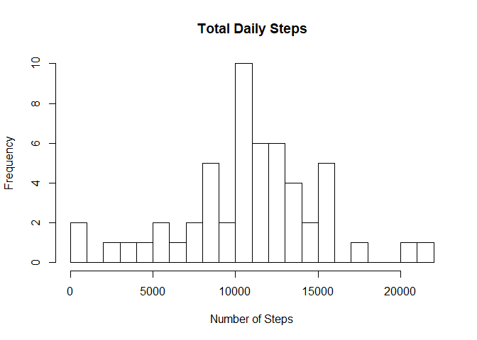
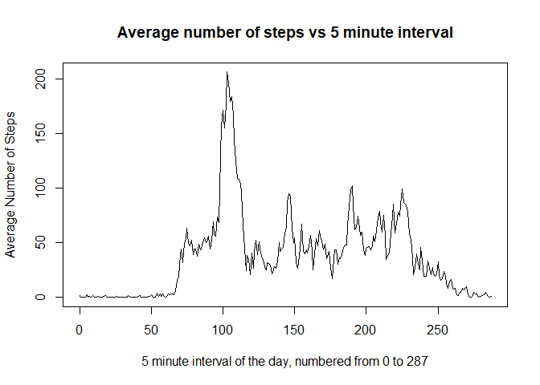
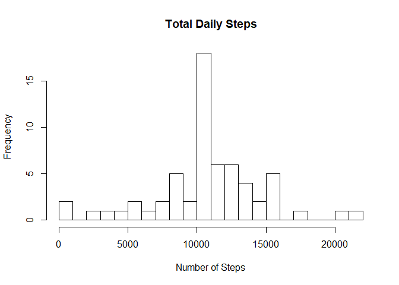

# Reproducible Research Course Project 1
Rishabh Iyer  
July 23, 2017  


## Loading the data
The following code loads the data. For this to work, the csv file titled "activity.csv" needs to be in the working directory.


```r
unzip("activity.zip")
activity <- read.csv("activity.csv")
```
## Looking at the data
After loading data into Rstudio, I like to take a look at it.  I noticed that for the first date, October 8th, all the step values were NA. My interest piqued, I checked to see how many NA values were in the step column.  There were 2304. The activity data frame breaks each day into 5 minute intervals, meaning there are 288 intervals per day. 288 happens to evenly divide 2304 into 8.  At this point, I had a hunch that there are 8 days, each completely filled with NA values for the step numbers. I checked how many unique date values had at least one NA value for a step number. I found that there were 8, which means that by the pigeonhole principle, all step numbers for those dates were NA.  Those dates are October 1st, October 8th, November 1st, November 4th, November 9th, November 10th, November 14th, and November 30th, all 2012.

The other noteworthy part of the data is how the intervals are labeled. As noted above, there are 288 intervals a day, but they aren't labeled as 1 to 288. They are labeled with intervals of 5, with 60 looping over to the hundreds. i.e., 0, 5, 10, 15, 20,....,45, 50, 55, 100, 105, 110...,155, 200,...2355. Basically, these intervals take the form of military time, where the left two digits represent the hour and the right two digits the minutes.  This format is less helpful for our later analysis than a simple sequence of 0 to 287, so I have included code to convert this.


```r
length(unique(activity$date[is.na(activity$steps)]))
```

```
## [1] 8
```

```r
unique(activity$date[is.na(activity$steps)])
```

```
## [1] 2012-10-01 2012-10-08 2012-11-01 2012-11-04 2012-11-09 2012-11-10
## [7] 2012-11-14 2012-11-30
## 61 Levels: 2012-10-01 2012-10-02 2012-10-03 2012-10-04 ... 2012-11-30
```

```r
activity$interval <- 0:17567 %%288
```

## Total for each day
For this part of the assignment, we have to 1) calculate the total number of steps taken per day, 2) make a histogram of the total number of steps taken each day, and 3) calculate and report the mean and median of the total number of steps taken each day.

From running the code below, we see that the mean is 10766.19 steps, and the median is 10765 steps.


```r
totals <- data.frame("date" = unique(activity$date), "totalSteps" = integer(length(unique(activity$date))))
for(x in unique(activity$date)){
  totals$totalSteps[totals$date==x]=sum(activity$steps[activity$date==x])
}
rm(x)
hist(totals$totalSteps, breaks = 20, main = "Total Daily Steps", xlab = "Number of Steps")
```

<!-- -->

```r
print(paste("The mean number of total daily steps is", mean(totals$totalSteps, na.rm=TRUE)))
```

```
## [1] "The mean number of total daily steps is 10766.1886792453"
```

```r
print(paste("The median number of total daily steps is", median(totals$totalSteps, na.rm = TRUE)))
```

```
## [1] "The median number of total daily steps is 10765"
```

```r
rm(totals)
```
## Average Daily Activity Pattern
For this part of the assignment, we have to 1) Make a time series plot of the 5 minute interval and the average number of steps taken across all days and 2) answer the question: which 5 minute interval, on average across all days in the dataset, contains the maximum number of steps? From running the code below, we see that the 5 minute interval with the highest average number of steps is the interval between 8:35 and 8:40 (military time).


```r
steps <- integer(288)
for (x in 0:287){
  steps[x+1] = mean(activity$steps[activity$interval==x], na.rm = TRUE)
}
plot(0:287, steps, type = "l", main = "Average number of steps vs 5 minute interval", ylab = "Average Number of Steps", xlab = "5 minute interval of the day, numbered from 0 to 287")
```

<!-- -->

```r
maxint <- (which.max(steps)-1)*5
maxhour <- as.integer(maxint/60)
maxmin <- maxint - (maxhour*60)
tophour <- maxhour
topmin <- maxmin + 5
if(maxmin==55){
  topmin <- 0
  tophour <- maxhour + 1
}
if(maxmin<10){
  maxmin <- paste(0,maxmin,sep="")
}
if(topmin<10){
  topmin <-paste(0,topmin,sep="")
}
print(paste("The 5 minute interval with the highest average number of steps is the interval between ", maxhour,":",maxmin, " and ", tophour,":",topmin," (military time).", sep = ""))
```

```
## [1] "The 5 minute interval with the highest average number of steps is the interval between 8:35 and 8:40 (military time)."
```

```r
rm(maxhour, maxint, maxmin, tophour,topmin, x)
```
## Inputting missing values
For this assignment, we have to 1) Calculate and report the total number of missing values in the dataset (the total number of rows with NAs), 2) Devise a strategy for filling in the missing values, 3) create a new dataset that is equal to the original dataset but with the missing values filled in, 4) Make a histogram of the total number of steps taken each day and Calculate and report the mean and median total number of steps taken per day. Do these values differ from the estimates from the first part of the assignment? What is the impact of imputing missing data on the estimates of the total daily number of steps?

From the above analysis, we already know there are 2304 missing values, but we'll repeat the analysis here for the sake of following the assignment. For the sake of the missing values, we'll replace each missing value with the average step value for that interval across all days.

Given our strategy for filling in the missing values, the mean number of total steps per day should not change, and the median should move toward the mean. Regarding the histogram, our strategy for filling in the missing values will add 8 values to the cell containing the mean, so the cell in the histogram containing the mean will increase in height by 8 units. Running the code confirms these predictions.  Regarding estimates of the total daily number of steps, our strategy for imputing missing data does not change the mean estimate but brings the median estimate closer to the mean (i.e., increases it in this case). The new mean is 10766.19, and the new median is 10766.19.  The mean does not differ from the first part of the assignment.  The median is greater than the median from the first part of the assignment.  The impact of imputing missing data on the estimates is to leave the mean unchanged but to increase the median.

```r
print(paste("There are", sum(is.na(activity)), "missing values in the activity dataset."))
```

```
## [1] "There are 2304 missing values in the activity dataset."
```

```r
activity2 <- activity
for (x in unique(activity2$date[is.na(activity2$steps)])){
  activity2$steps[activity2$date==x] <-steps
}
totals2 <- data.frame("date" = unique(activity2$date), "totalSteps" = integer(length(unique(activity2$date))))
for(x in unique(activity2$date)){
  totals2$totalSteps[totals2$date==x]<-sum(activity2$steps[activity2$date==x])
}
rm(x)
hist(totals2$totalSteps, breaks = 20, main = "Total Daily Steps", xlab = "Number of Steps")
```

<!-- -->

```r
print(paste("The mean number of total daily steps is", mean(totals2$totalSteps)))
```

```
## [1] "The mean number of total daily steps is 10766.1886792453"
```

```r
print(paste("The median number of total daily steps is", median(totals2$totalSteps)))
```

```
## [1] "The median number of total daily steps is 10766.1886792453"
```

```r
rm(totals2, steps, activity)
```
## Weekdays
For this assignment, we have to use the filled in dataset and 1) create a new factor variable, indicating whether a given day is a weekday or a weekend day, and 2) make a panel plot containing a time series plot of the interval and average number of steps taken, averaged over weekdays or weekend days.

```r
activity2$dayType <- as.factor(ifelse(weekdays(as.Date(activity2$date))=="Saturday" | weekdays(as.Date(activity2$date))=="Sunday", "Weekend", "Weekday"))
par(mfrow=c(2,1))
dframe <- matrix(data = NA, nrow = 576, ncol = 3)
a<-1
for (i in 0:287){
  for (j in levels(activity2$dayType)){
    dframe[a,1]<- mean(activity2$steps[activity2$interval==i & activity2$dayType==j])
    dframe[a,2]<-i
    dframe[a,3]<-j
    a <- a+1
  }
}
rm(a, i, j, activity2)
dframe <- as.data.frame(dframe)
colnames(dframe) <- c("meanSteps", "intervalNumber", "dayType")
dframe$intervalNumber <- as.factor(dframe$intervalNumber)
dframe$dayType <- as.factor(dframe$dayType)
plot(0:287, dframe$meanSteps[dframe$dayType=="Weekday"], type = "l", main = "Mean Steps per interval for Weekdays", xlab = "5 minute interval, numbered from 0 to 287", ylab = "mean steps")
plot(0:287, dframe$meanSteps[dframe$dayType=="Weekend"], type = "l", main = "Mean Steps per interval for Weekends", xlab = "5 minute interval, numbered from 0 to 287", ylab = "mean steps")
```

<!-- -->

```r
rm(dframe)
```
